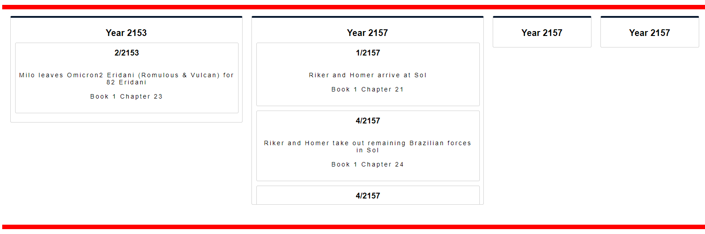

# SimpleTimeline

Simple Timeline is css based but uses a js class to build the timeline from data. Simple Timeline is still being built but will be draggable and should work via touch. 

## Still being written

Origin of starting css is https://stackoverflow.com/questions/21916615/horizontal-timeline-in-pure-css/21920076 by https://github.com/rokobuljan



```javascript
<simpleTimeline class="timeline"></simpleTimeline>

<script>
	let timelineOptions = 
	{
		containerEl: document.querySelector('.timeline'),
		data: [
		   {
			  "year":2016,
			  "month":7,
			  "day":null,
			  "order":0,
			  "title":"Bob dies",
			  "content":"Book 1 Chapter 1"
		   },
		   {
			  "year":2036,
			  "month":null,
			  "day":null,
			  "order":1,
			  "title":"US elects fundamentalist president",
			  "content":"Book 1 Chapter 2"
		   }
    ]
  };
  let timeline = new SimpleTimeline(timelineOptions);
</script>
```
